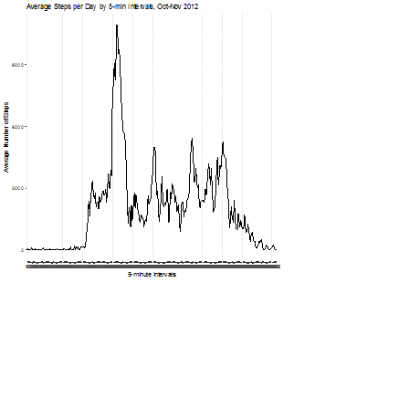
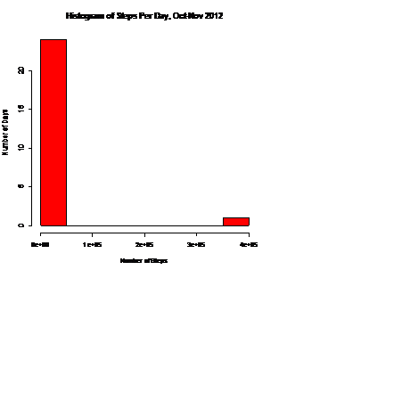

Developing Data Products, Course Project 1
Nicole Ansani
June 1 2017

Assignment

This assignment will be described in multiple parts. You will need to write a report that answers the questions detailed below. Ultimately, you will need to complete the entire assignment in a single R markdown document that can be processed by knitr and be transformed into an HTML file.

Throughout your report make sure you always include the code that you used to generate the output you present. When writing code chunks in the R markdown document, always use echo = TRUE so that someone else will be able to read the code. This assignment will be evaluated via peer assessment so it is essential that your peer evaluators be able to review the code for your analysis.

For the plotting aspects of this assignment, feel free to use any plotting system in R (i.e., base, lattice, ggplot2)

Fork/clone the GitHub repository created for this assignment. You will submit this assignment by pushing your completed files into your forked repository on GitHub. The assignment submission will consist of the URL to your GitHub repository and the SHA-1 commit ID for your repository state.
=============
Load the Data:
```> if (!file.exists("activity.csv")) {
+     unzip("activity.zip")
+ }
```> activity <- read.csv("activity.csv")
----------------
Clean the Data:
```> activity$date <- as.Date(activity$date)
```> activity$interval <- as.factor(activity$interval)
---------------------------
Mean total steps taken per day - histogram
```> library(plyr)
```> steps_per_day <- ddply(activity, .(date), summarise, sum = sum(steps, na.rm=T))
```> steps_per_day
         date    sum
1  0010-01-20      0
2  0010-02-20    126
3  0010-03-20  11352
4  0010-04-20  12116
5  0010-05-20  13294
6  0010-06-20  15420
7  0010-07-20  11015
8  0010-08-20      0
9  0010-09-20  12811
10 0010-10-20   9900
11 0010-11-20  10304
12 0010-12-20  17382
13 0011-01-20      0
14 0011-02-20  10600
15 0011-03-20  10571
16 0011-04-20      0
17 0011-05-20  10439
18 0011-06-20   8334
19 0011-07-20  12883
20 0011-08-20   3219
21 0011-09-20      0
22 0011-10-20      0
23 0011-11-20  12608
24 0011-12-20  10765
25       <NA> 377469
----------------------------
```> hist(steps_per_day$sum, ylab="Number of Days", col="blue", xlab="Number of Steps", main="Histogram of Steps Per Day, Oct-Nov 2012")




===============================
================================
calculate and report mean total steps per day
```> mean(steps_per_day$sum)
[1] 22824.32
=================================
calculate and report median total steps per day
```> median(steps_per_day$sum)
[1] 10571
======================================
what is the average daily activity pattern
time series plot of 5-min interval and the ave number of steps taken then averaged across all days
```> library(ggplot2)
```> steps_per_interval <- ddply(activity, .(interval), summarise, sum = sum(steps, na.rm=T))
```> p <- ggplot(steps_per_interval, aes(x=interval, y=sum, group=1)) 
```> p + geom_line() + labs(title = "Average Steps per Day by 5-min Intervals, Oct-Nov 2012") + labs(x = "5-minute Intervals", y = "Average Number of Steps")
> 




=====================================
which 5 min interal on average across all days contains the max number of steps?
```> steps_per_interval[ which(steps_per_interval$sum==(max(steps_per_interval$sum))), ]
    interval   sum
104      835 10927
> 
====================================
Imputing missing values
calculate and report the total number of missing values in the dataset

```> NA_values <- activity[!complete.cases(activity),]
```> nrow(NA_values)

[1] 12384
--------------------------------
devise a strategy to fill in all missing values in the dataset using mean for 5 min interval
> ##start by calculating mean for each interval

```> interval_mean <- ddply(activity, .(interval), summarise, mean = mean(steps, na.rm=T))

------------------------
> ##add that interval as mean for missing values
```> activity_with_interval_mean <- ```join(activity, interval_mean)
```Joining by: interval
--------------------------------
> ## replace NA values

```> replace_NA <- function(dataset, variable, replacement) {
+     for (i in 1:nrow(dataset)) {
+         if (is.na(dataset[i, variable])) {
+                 dataset[i, variable] <- dataset[i, replacement]
+         }
+     }
+     dataset
+ }

```> ##run that function on the dataset
```> complete_activity <- replace_NA(activity_with_interval_mean, variable=1, replacement=4)
> 

```> complete_activity <- complete_activity[, -4]

```> head(complete_activity)
      steps       date interval
1 1.7169811 0010-01-20        0
2 0.3396226 0010-01-20        5
3 0.1320755 0010-01-20       10
4 0.1509434 0010-01-20       15
5 0.0754717 0010-01-20       20
6 2.0943396 0010-01-20       25
> 
===================================
make a histogram of the total number of steps each day and calculate and report the mean and median using the imputed data set

```> complete_steps_per_day <- ddply(complete_activity, .(date), summarise, sum = sum(steps))

```> complete_steps_per_day$sum <- round(complete_steps_per_day$sum)
```> hist(complete_steps_per_day$sum, ylab="Number of Days", col="red", xlab="Number of Steps", main="Histogram of Steps Per Day, Oct-Nov 2012")
> 
---------------------------------
calculate mean and median total steps per day with imputed data

```> mean(steps_per_day$sum)
[1] 22824.32

```> mean(complete_steps_per_day$sum)
[1] 26269.44

```> median(steps_per_day$sum)
[1] 10571
```> median(complete_steps_per_day$sum)
[1] 10766

> ###do these data differ?
> ##yes  the mean and median values are higher with the imputed data set


===================================
```> > par(mfrow=c(1,2)) 
```> hist(steps_per_day$sum, ylab="Number of Days", col=rgb(1,0,0,0.2), xlab="Number of Steps", main="Steps Per Day, Excl. NA")
```> hist(complete_steps_per_day$sum, ylab="Number of Days", col=rgb(0,0,1,0.2), xlab="Number of Steps", main="Steps Per Day, Impute NA")
> 
======================================
Are there differences in activity patterns between weekdays and weekends?
use the dataset with the filled in data for this part

```> complete_activity$dayType <- ifelse(as.POSIXlt(complete_activity$date)$wday %in% c(0,6), "weekends", "weekdays")
```> aggregateData <- aggregate(steps~interval + dayType, data=complete_activity,mean)
```> ggplot(complete_activity, aes(interval, steps)) + geom_line() + facet_grid(dayType ~ .) + xlab("5-minute interval") + ylab("average number of steps")
> 


```{r setup, include=FALSE}
knitr::opts_chunk$set(echo = TRUE)
```

## R Markdown

This is an R Markdown document. Markdown is a simple formatting syntax for authoring HTML, PDF, and MS Word documents. For more details on using R Markdown see <http://rmarkdown.rstudio.com>.

When you click the **Knit** button a document will be generated that includes both content as well as the output of any embedded R code chunks within the document. You can embed an R code chunk like this:

```{r cars}
summary(cars)
```

## Including Plots

You can also embed plots, for example:panel plot


```{r pressure, echo=FALSE}
plot(pressure)
```

Note that the `echo = FALSE` parameter was added to the code chunk to prevent printing of the R code that generated the plot.
